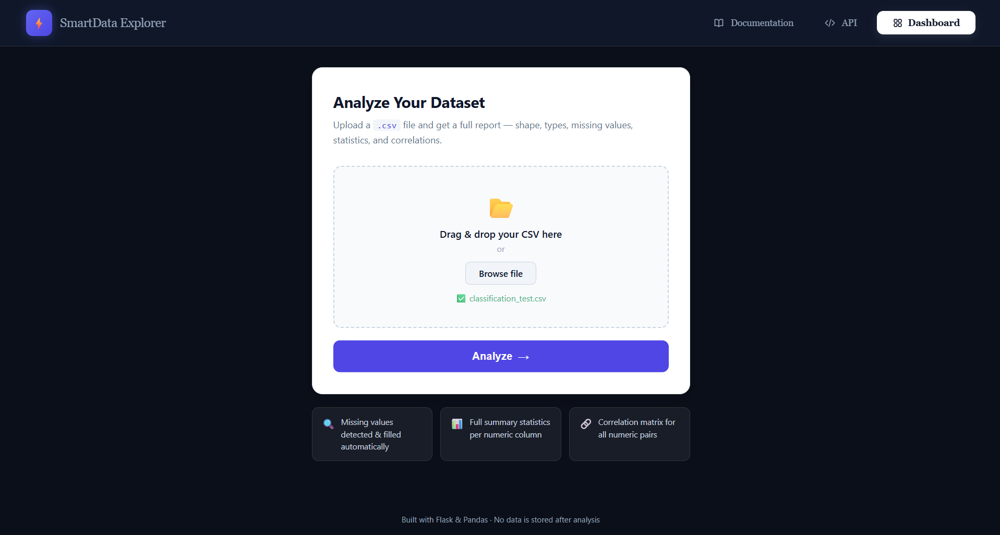
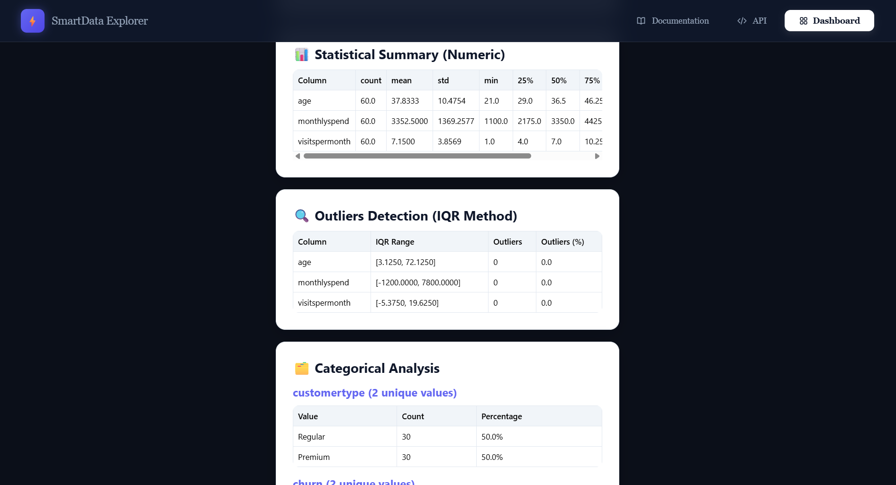
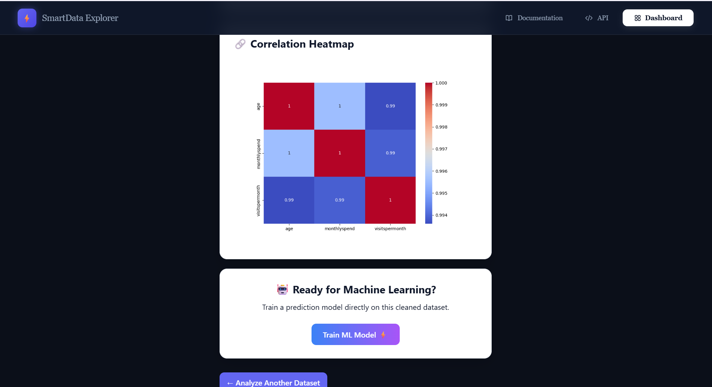
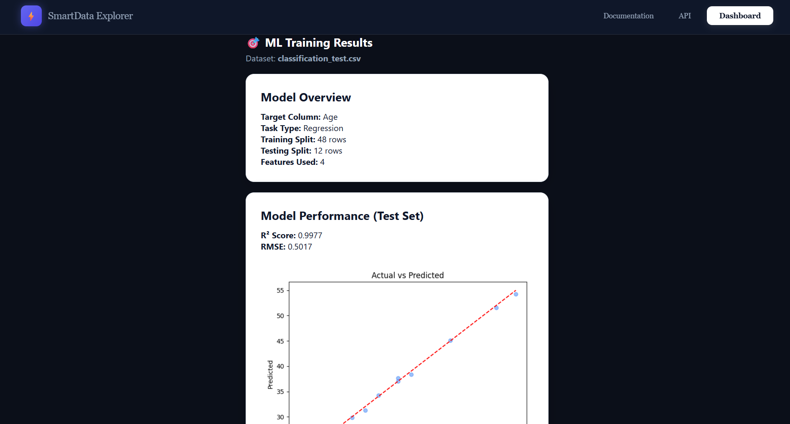
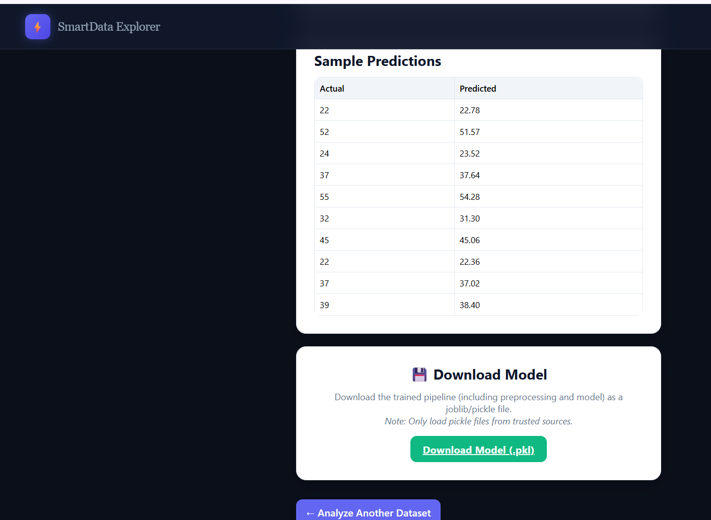

# 🚀 SmartData Explorer

A Python-powered web application for **Exploratory Data Analysis (EDA), data preprocessing, visualization, and machine learning** — all through a simple web interface.

<p align="center">
  
  
  
  
  
</p>

## 📌 Overview

**SmartData Explorer** is a Flask-based application designed to simplify data analysis and machine learning workflows. Users can upload CSV datasets, inspect data quality, explore statistical summaries, visualize relationships between variables, and train machine learning models through a web interface.

The application combines Pandas and NumPy for data processing, statistical analysis for discovering patterns, Matplotlib and other visualization tools where applicable, and Scikit-learn pipelines for machine learning workflows.

It also provides a structured results dashboard, model download functionality, and temporary file management.

## 🌐 Live Demo & Repository

- **Live Application:** [SmartData Explorer](https://smartdata-explorer.onrender.com)
- **GitHub Repository:** [sagartripathi027/SmartData-Explorer](https://github.com/sagartripathi027/SmartData-Explorer)

> Note: The live application's available features may differ from the latest local development version.

## 📸 Application Screenshots

Here is a quick look at the SmartData Explorer workflow:

| Data Upload & Dashboard | Automated EDA & Analysis |
|:---:|:---:|
|  |  |

| Correlation Heatmap | Machine Learning Results |
|:---:|:---:|
|  |  |

<p align="center">
  <b>Sample Predictions & Model Download</b><br>
  
</p>

## ✨ Key Features

### 📂 Data Upload & Preprocessing
- Upload CSV datasets through the web interface.
- Validate uploaded data before analysis.
- Inspect missing values and dataset characteristics.
- Perform data cleaning and preprocessing.
- Handle supported numeric and categorical features.

### 📊 Exploratory Data Analysis (EDA)
- Generate descriptive statistical summaries.
- Analyze distributions of numerical variables.
- Explore correlations between numeric features.
- Visualize relationships through correlation heatmaps.
- Identify potential outliers and anomalies.
- Present analysis results in a structured dashboard.

### 🤖 Machine Learning
- Configure supported machine learning tasks.
- Train models using the application's ML workflow.
- Apply preprocessing through Scikit-learn pipelines.
- Separate training and evaluation data to help prevent data leakage.
- Support applicable classification and regression workflows.
- Download trained models through the model download feature.

*Available algorithms and configuration options depend on the implemented model-training workflow.*

### 🔒 File Handling
- Generate unique identifiers for uploaded files.
- Manage temporary uploaded datasets and generated artifacts.
- Automatically clean up eligible temporary files.
- Keep uploaded data separate from the analysis interface.

## 🧠 Tech Stack

| Category | Technologies |
|---|---|
| Language | Python |
| Backend | Flask |
| Data Processing | Pandas, NumPy |
| Machine Learning | Scikit-learn |
| Visualization | Matplotlib, Plotly (where used) |
| Frontend | HTML5, CSS3, JavaScript |
| Data Validation | Python-based validation and preprocessing |
| Deployment | Render |

## ⚙️ Installation & Setup

### Prerequisites

- Python 3.10 or a compatible version supported by the project's dependencies
- pip
- Git

### 1. Clone the repository

```bash
git clone https://github.com/sagartripathi027/SmartData-Explorer.git
cd SmartData-Explorer
```

### 2. Create a virtual environment

**Windows (PowerShell):**

```powershell
python -m venv venv
.\venv\Scripts\Activate.ps1
```

If PowerShell blocks activation, use Command Prompt:

```bat
venv\Scripts\activate.bat
```

**macOS/Linux:**

```bash
python3 -m venv venv
source venv/bin/activate
```

### 3. Install dependencies

```bash
python -m pip install --upgrade pip
pip install -r requirements.txt
```

### 4. Run the application

```bash
python app.py
```

### 5. Open the application

Visit:

[http://127.0.0.1:5000](http://127.0.0.1:5000)

Make sure the dependencies are installed and any required environment variables are configured before starting the application.

## 📁 Project Structure

The following is a representative structure. Refer to the actual repository for the complete and current file layout.

```text
SmartData-Explorer/
│
├── app.py                 # Flask application and routes
├── analysis.py            # Data analysis and EDA logic
├── ml_engine.py           # Machine learning pipeline
├── requirements.txt       # Python dependencies
│
├── templates/             # HTML templates
│   ├── index.html         # Main interface
│   └── result.html        # Analysis results, if present
│
├── static/                # CSS, JavaScript and generated assets
│
├── uploads/               # Temporary uploaded datasets
├── data/                  # Sample or project data, if present
│
└── README.md              # Project documentation
```

**Important:** Runtime folders, templates, and generated artifacts may vary by version. Do not commit private datasets, uploaded user files, generated secrets, or local environment files.

## 🔐 Configuration & Security

- Keep secret keys and credentials outside source control.
- Store local environment variables in an untracked `.env` file when supported by the application.
- Configure upload limits and file validation according to the application's settings.
- Use unique filenames for uploaded files.
- Clean up expired temporary files and generated artifacts.
- Do not upload sensitive or confidential datasets to a public deployment.

Example `.gitignore` entries:

```gitignore
venv/
.venv/
__pycache__/
*.py[cod]
.env
uploads/*
!uploads/.gitkeep
instance/
.pytest_cache/
```

Review these entries against the actual project before applying them. Add other generated-file exclusions only when appropriate, and never ignore source files required by the application.

## 🧪 Testing & Verification

Before deploying a change, verify the relevant workflows:

- [ ] Application starts successfully.
- [ ] CSV upload and validation work.
- [ ] EDA results display correctly.
- [ ] Correlation heatmaps and statistical summaries render correctly.
- [ ] Classification and regression workflows handle supported target columns.
- [ ] Invalid input produces understandable error messages.
- [ ] Model downloads work when a model has been trained.
- [ ] Temporary file cleanup behaves as expected.
- [ ] No secrets or private datasets are committed.

## 🛣️ Future Improvements

Potential enhancements for future versions:

- [ ] Excel and additional dataset format support.
- [ ] More configurable data transformations.
- [ ] Additional visualization options.
- [ ] Downloadable analysis reports.
- [ ] More machine learning algorithms and evaluation metrics.
- [ ] Improved data quality summaries.
- [ ] Persistent analysis history, if required.
- [ ] Expanded automated testing and deployment checks.

## 📋 Dependencies

Install dependencies from the maintained requirements file:

```bash
pip install -r requirements.txt
```

The `requirements.txt` file is the source of truth for dependency versions. Avoid documenting hard-coded versions here unless they match the current environment.

## 📝 License

This project is licensed under the MIT License. See the [LICENSE](LICENSE) file for details, if included in the repository.

## 👨‍💻 Author

**Sagar Tripathi**

- **GitHub:** [@sagartripathi027](https://github.com/sagartripathi027)
- **Project Repository:** [SmartData Explorer](https://github.com/sagartripathi027/SmartData-Explorer)

## 🙏 Acknowledgments

- [Flask](https://flask.palletsprojects.com/) for the web framework.
- [Pandas](https://pandas.pydata.org/docs/) and [NumPy](https://numpy.org/doc/) for data processing.
- [Scikit-learn](https://scikit-learn.org/stable/) for machine learning tools.
- [Matplotlib](https://matplotlib.org/) and [Plotly](https://plotly.com/python/) for visualization.

---

<p align="center">
  If you find this project useful, consider giving it a ⭐ on GitHub.
</p>

<p align="center">
  Built with ❤️ by <a href="https://github.com/sagartripathi027">Sagar Tripathi</a>
</p>